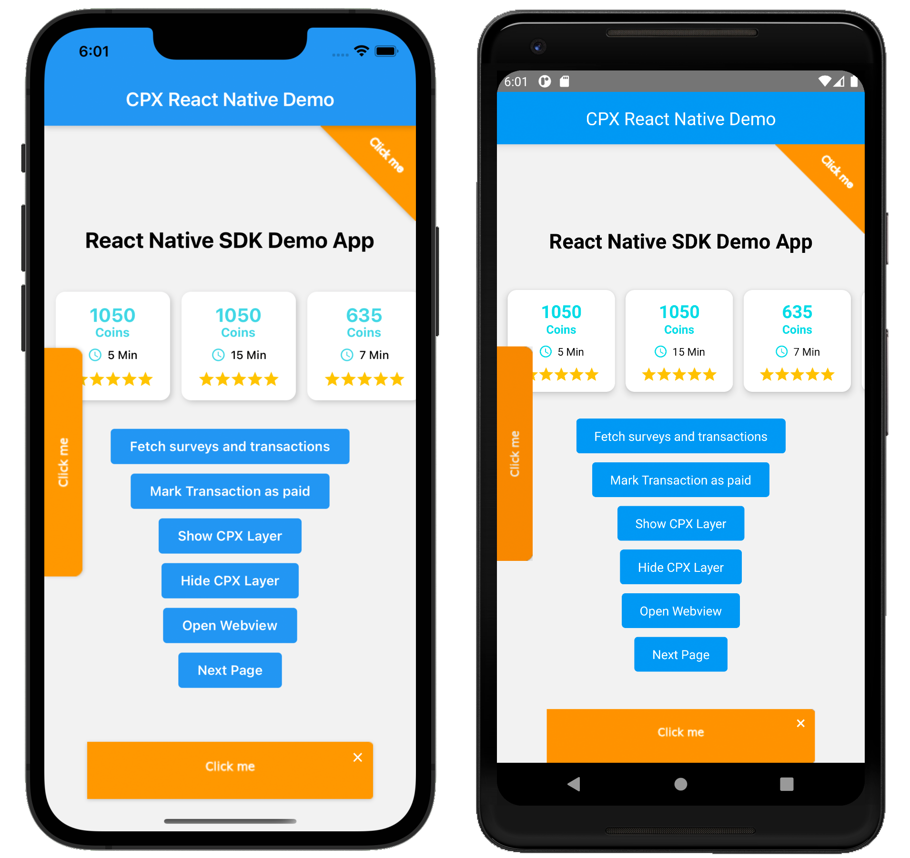

# CPX Research SDK React Native

**Monetize your product with fun surveys.**

We will make it easy for you: Simply implement our solution and be ready to start monetizing your product immediately!
Let users earn your virtual currency by simply participating in exciting and well paid online surveys!

This SDK is owned by [MakeOpinion GmbH](http://www.makeopinion.com).

[Learn more.](https://www.cpx-research.com/main/en/)

# Table of Contents

- [Preview](#preview)
- [Installation](#installation)
- [Usage](#usage)
- [For Developers](#for-developers)

# Preview


# Installation

1. Install the SDK like any other npm package, using yarn or npm
``` 
yarn add cpx-research-sdk-react-native

# or

npm install cpx-research-sdk-react-native
```

2. Now import the package in your JavaScript files and use it like any other React Component.
```javascript
import CpxResearch from "cpx-research-sdk-react-native";
```

# Usage

## Getting Started (Easy)

### Basic Configuration
Customize every CPX Widget as it fits your needs.
Below are all required/basic configuration options for the CPX Widget. There are a few additional ones, but more on that later.

Note: If you don't pass a configuration for any of the corner, sidebar or notification widgets, these specific widgets will then not be displayed.
```jsx
<CpxResearch
  accentColor="#ff9800"  // the accent color for the browser/webview icons an progress bars
  appId="1"
  userId="2"
  isHidden={isCpxLayerHidden}  // in case you want to hide the widget completely, simplye pass a boolean (for example a state variable).
  cornerWidget={{
    backgroundColor: "#ff9800",
    position: "topright",
    roundedCorners: 0,
    size: 100,
    text: "Click me",
    textColor: "#ffffff",
    textSize: 12,
  }}
  notificationWidget={{
    backgroundColor: "#ff9800",
    height: 60,
    isSingleSurvey: true,
    position: "bottom",
    roundedCorners: 10,
    text: "Click me",
    textColor: "#ffffff",
    textSize: 12,
    width: 300,
  }}
  sidebarWidget={{
    backgroundColor: "#ff9800",
    height: 240,
    position: "left",
    roundedCorners: 10,
    text: "Click me",
    textColor: "#ffffff",
    textSize: 12,
    width: 60,
  }}
/>
```

### Only Specific Views
To display the CPXResearch Widget only in specific views, simply add it inside those views (for example in a specific page/route in your app).
The CPX Widget will take the available space.

Here is an example using React Navigation, where the CPX Widget is only displayed on the Home Page 
(for further details please have a look at the demo app in the demo_app sub folder. There you will find this exact example).
```jsx
// App.jsx

const App = () => (
  <NavigationContainer>
    <Stack.Navigator>
      <Stack.Screen
        name="Home"
        component={HomeScreen}  // The CPX Widget is embedded in this component
        options={{ header: () => <Header title="CPX React Native Demo"/> }}
      />
      <Stack.Screen
        name="Page 2"
        component={Page2Screen}
        options={{ header: () => <Header title="Demo App Page 2"/> }}
      />
    </Stack.Navigator>
  </NavigationContainer>
);
```

```jsx
// Home.screen.jsx

const HomeScreen = () => (
  <>
      <CpxResearch
        appId="1"
        userId="2"
        accentColor="#ff9800"
        cornerWidget={{ /* ... */ }}
        notificationWidget={{ /* ... */ }}
        sidebarWidget={{ /* ... */ }}
      />
      <SafeAreaView style={/* ... */}>
        <View style={/* ... */}>
          <Text>React Native SDK Demo App</Text>
          <Text>CPX Research</Text>
        </View>
      </SafeAreaView>
    </>
);
```

### Entire App Overlay
For an entire app overlay add the CPX Widget next to your root component, using a fragment, like in the example below:
```jsx
const App = () => (
  <>
    <CpxResearch
      appId="1"
      userId="2"
      accentColor="#ff9800"
      cornerWidget={{ /* ... */ }}
      notificationWidget={{ /* ... */ }}
      sidebarWidget={{ /* ... */ }}
    />
    <NavigationContainer>
      <Stack.Navigator>
        <Stack.Screen
          name="Home"
          component={HomeScreen}  // No CPX Widget anymore in this component
          options={{ header: () => <Header title="CPX React Native Demo"/> }}
        />
        <Stack.Screen
          name="Page 2"
          component={Page2Screen}
          options={{ header: () => <Header title="Demo App Page 2"/> }}
        />
      </Stack.Navigator>
    </NavigationContainer>
  </>
);
```

## Getting Started (Expert)
As stated above, it is possible to not pass any configuration for the corner, sidebar or notification widgets, which then means none of them will be display.
This might be especially useful if you want to build your own widgets/components. 
For this use-case, the SDK provides multiple callbacks/methods where you can get the required data:

Now handle the CPXResearch Response with the listeners below and use your own Widgets to display the surveys.
```jsx
const HomeScreen = () =>
{
  /**
   * Create refs for the methods the SDK provides and bind them like shown below.
   * Then you can call them like any other function (have a look at the TouchableOpacity Buttons below)
   */
  const markTransactionAsPaidRef = useRef();
  const fetchSurveysAndTransactionsRef = useRef();
  const openWebViewRef = useRef();
  
  /**
   * Add the change callbacks for the surveys and transactions updates
   */
  const onSurveysUpdate = surveys =>
  {
    console.log("onSurveysUpdate Callback", surveys);
  };

  const onTransactionsUpdate = transactions =>
  {
    console.log("onSurveysUpdate Callback", transactions);
  };

  return (
    <>
      <CpxResearch
        /* ... */
        // add the callback methods:
        onSurveysUpdate={onSurveysUpdate}  // will be called when the surveys updated
        onTransactionsUpdate={onTransactionsUpdate}  // will be called when the transactions updated
        // bind the refs:
        bindMarkTransactionAsPaid={markTransactionAsPaid => markTransactionAsPaidRef.current = markTransactionAsPaid}
        bindFetchSurveysAndTransactions={fetchSurveysAndTransactions => fetchSurveysAndTransactionsRef.current = fetchSurveysAndTransactions}
        bindOpenWebView={openWebView => openWebViewRef.current = openWebView}
        /* ... */
      />
      <SafeAreaView style={styles.appWrapper}>
        <View style={styles.viewContainer}>
          { /* use the refs */ }
          <TouchableOpacity style={styles.button} onPress={() => fetchSurveysAndTransactionsRef.current?.()}>
            <Text style={styles.buttonText}>Fetch surveys and transactions</Text>
          </TouchableOpacity>
          <TouchableOpacity style={styles.button} onPress={() => markTransactionAsPaidRef.current?.("123", "345")}>
            <Text style={styles.buttonText}>Mark Transaction as paid</Text>
          </TouchableOpacity>
          <TouchableOpacity style={styles.button} onPress={() => openWebViewRef.current?.(/* pass optional surveyId here */)}>
            <Text style={styles.buttonText}>Open Webview</Text>
          </TouchableOpacity>
        </View>
      </SafeAreaView>
    </>
  );
};

export default HomeScreen;
```

**Note**: For a typescript example have a look at the demo app in the demo_app sub folder


# For Developers

If you made changes to the SDK (in the cpx_research_sdk_react_native sub folder), you need to update the version number in the package json in the sub folder and publish these changes to npm.
In order to do that, run `npm publish` from the sub folder (not from the root directory!)
